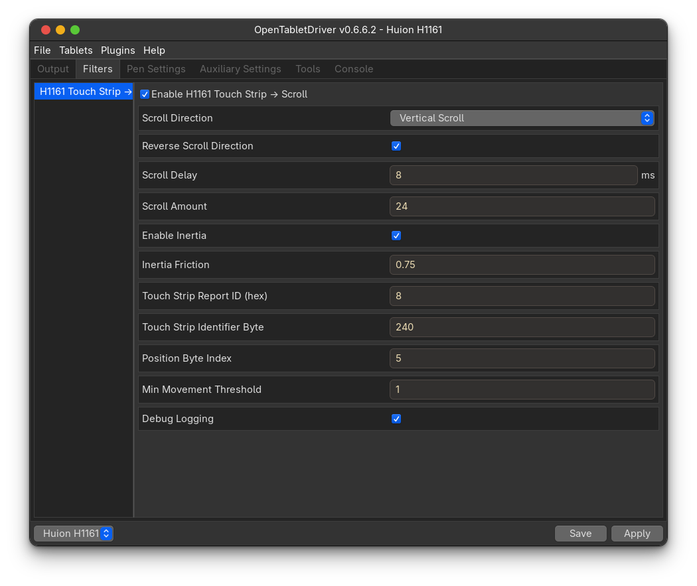
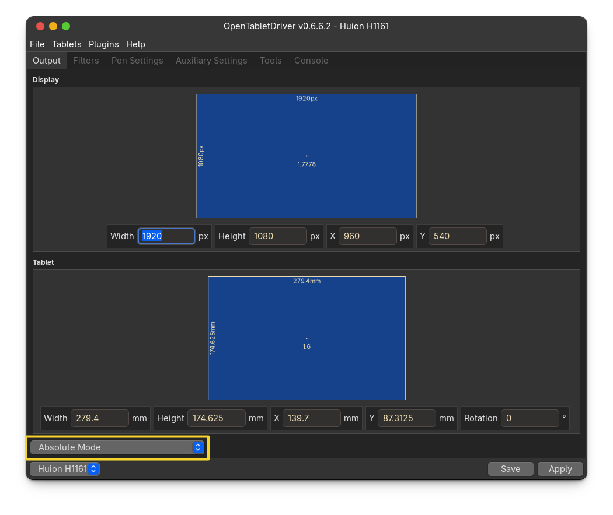

# H1161 Touch Strip Plugin for OpenTabletDriver

> **⚠️ Alpha Release** — This plugin has been rewritten from the ground up. It may contain bugs. Please report any issues.

[](https://github.com/alvayesmoore/H1161TouchStrip-plugin/releases)

Converts the Huion Inspiroy H1161 touch strip into native Linux scroll events using a virtual evdev device. No external plugins required.

## Features

- **Direct scroll output** — creates a virtual evdev device that emits hi-res scroll events directly to the OS
- **No dependencies** — does not require the Scroll Bindings plugin or any other plugin
- **Vertical or horizontal scrolling** — switch between vertical and horizontal scroll direction
- **Reverse direction** — flip scroll direction if up/down feels inverted
- **Inertia scrolling** — optional momentum that continues scrolling briefly after lifting your finger
- **Configurable speed** — adjustable scroll amount and delay between scroll ticks
- **Debug logging** — toggle verbose output for troubleshooting

## Prerequisites

- **Linux** or **Windows**
- **.NET SDK 8.0**

### Linux-specific

- **libevdev** — system library for virtual input device creation

Install libevdev:

```bash
# Arch / CachyOS
sudo pacman -S libevdev

# Ubuntu / Debian
sudo apt install libevdev-dev

# Fedora
sudo dnf install libevdev-devel
```

## Installation

### Build from source

**Linux:**

```bash
git clone https://github.com/alvayesmoore/H1161TouchStrip-plugin.git
cd H1161TouchStrip-plugin
dotnet build -c Release
```

**Windows (PowerShell):**

```powershell
git clone https://github.com/alvayesmoore/H1161TouchStrip-plugin.git
cd H1161TouchStrip-plugin
dotnet build -c Release
```

### Install the plugin

**Linux:**

```bash
mkdir -p ~/.config/OpenTabletDriver/Plugins/H1161TouchStrip
cp bin/Release/net8.0/H1161TouchStrip.dll ~/.config/OpenTabletDriver/Plugins/H1161TouchStrip/
```

**Windows:**

```powershell
# Create plugins directory if it doesn't exist
$pluginDir = "$env:USERPROFILE\.config\OpenTabletDriver\Plugins\H1161TouchStrip"
if (!(Test-Path $pluginDir)) {
    New-Item -ItemType Directory -Path $pluginDir -Force
}
Copy-Item bin\Release\net8.0\H1161TouchStrip.dll $pluginDir\
```

Or use the included script:

**Linux:**

```bash
chmod +x build-and-install.fish
./build-and-install.fish
```

**Windows:**

```powershell
.\build-and-install.ps1
```

### Restart OpenTabletDriver

**Linux:**

```bash
systemctl --user restart opentabletdriver.service
# OR restart the GUI manually
```

**Windows:**

Restart the OpenTabletDriver daemon or restart the GUI manually.

## Configuration

### Add to Filter Pipeline

1. Open OpenTabletDriver GUI
2. Go to **Tablets** → select your H1161 → **Configuration**
3. In the **Filters** section, add **H1161 Touch Strip → Scroll**
4. Save configuration

### Filter Settings

| Setting | Default | Description |
|---|---|---|
| Scroll Direction | Vertical Scroll | Vertical or horizontal scroll |
| Reverse Scroll Direction | false | Flip scroll direction |
| Scroll Delay | 15 ms | Delay between scroll events (1–1000 ms) |
| Scroll Amount | 120 | Scroll amount per tick (0–2400) |
| Enable Inertia | false | Continue scrolling after finger lift |
| Inertia Friction | 0.85 | Deceleration factor (0.50–0.95). Lower = faster stop |
| Touch Strip Report ID (hex) | 0x08 | HID report ID identifying touch strip data |
| Touch Strip Identifier Byte | 0xF0 | Second byte identifier for touch strip reports |
| Position Byte Index | 5 | Byte index containing the touch position |
| Min Movement Threshold | 1 | Minimum position change to trigger scroll |
| Debug Logging | false | Enable verbose console output |

No additional plugins or binding configuration is needed — the virtual evdev device sends scroll events directly to the OS.

### Recommended Defaults



> **Important:** The tablet output mode must be set to **Absolute** for the plugin to receive touch strip reports correctly.
>
> 

## How It Works

1. The plugin registers as a pipeline filter in OpenTabletDriver
2. It inspects every raw HID report from the tablet
3. When it detects a touch strip report (report ID `0x08`, identifier `0xF0`), it reads the position byte
4. Position changes between consecutive reports determine scroll direction and velocity
5. A virtual evdev device named **H1161 Touch Strip** writes hi-res scroll events (`REL_WHEEL_HI_RES` / `REL_HWHEEL_HI_RES`) directly to the Linux input subsystem
6. If inertia is enabled, scrolling continues briefly after finger lift with friction-based deceleration

## Raw Data Format

The H1161 touch strip sends 12-byte HID reports:

```
Position 0 (no touch):  08 F0 01 01 00 00 00 00 00 00 13 F5
Position 1 (top):       08 F0 01 01 00 01 00 00 00 00 13 F5
Position 2:             08 F0 01 01 00 02 00 00 00 00 13 F5
Position 3:             08 F0 01 01 00 03 00 00 00 00 13 F5
Position 4:             08 F0 01 01 00 04 00 00 00 00 13 F5
Position 5:             08 F0 01 01 00 05 00 00 00 00 13 F5
Position 6:             08 F0 01 01 00 06 00 00 00 00 13 F5
Position 7 (bottom):    08 F0 01 01 00 07 00 00 00 00 13 F5
```

Key bytes:
- **Byte 0**: Report ID = `0x08`
- **Byte 1**: Identifier = `0xF0`
- **Byte 5**: Position = `0x00` (no touch) or `0x01`–`0x07` (touch position, top to bottom)

## Troubleshooting

### Touch strip not scrolling

**Linux:**

1. **Check plugin is loaded** — look for `[H1161TouchStrip]` in OTD logs:
```bash
journalctl --user -u opentabletdriver -f
```

2. **Enable debug logging** — set **Debug Logging** to `true` in filter settings, slide the strip, and check for output like:
```
[H1161TouchStrip] δ=+1 → scroll 120
```

3. **Check evdev device exists**:
```bash
cat /proc/bus/input/devices | grep -A5 "H1161 Touch Strip"
```

4. **Check uinput permissions**:
```bash
ls -la /dev/uinput
```
The OTD daemon user needs write access to `/dev/uinput`. If you get permission errors, see the setup guide.

**Windows:**

1. **Check plugin is loaded** — look for `[H1161TouchStrip]` in OTD logs or the log viewer in the GUI.

2. **Enable debug logging** — set **Debug Logging** to `true` in filter settings, slide the strip, and check the log output.

3. **Verify tablet mode** — ensure the tablet output mode is set to **Absolute** (not **Relative**).

### evdev init error (Linux only)

If you see `Failed to initialize evdev` in the logs:
- Ensure `libevdev` is installed
- Ensure `/dev/uinput` exists and is writable
- Try: `sudo modprobe uinput`

### Direction is inverted

Enable **Reverse Scroll Direction** in the filter settings.

### Too fast or too slow

- **Too fast**: Increase **Scroll Delay** or decrease **Scroll Amount**
- **Too slow**: Decrease **Scroll Delay** or increase **Scroll Amount**

## Files

| File | Description |
|---|---|
| `H1161TouchStripFilter.cs` | Main filter — processes touch strip reports and emits scroll events via evdev |
| `EvdevDevice.cs` | Linux evdev/uinput wrapper using libevdev P/Invoke |
| `H1161TouchStrip.csproj` | .NET 8.0 project file |
| `build-and-install.fish` | Fish shell build and install script |

## Screenshots

| Screenshot | Description |
|---|---|
|  | Recommended default settings for the H1161 Touch Strip filter |
|  | Tablet output mode must be set to **Absolute** |

## License

Feel free to modify and redistribute.

## Credits

- Evdev device implementation based on the [Scroll Bindings](https://github.com/Mrcubix/Scroll-Bindings) plugin by Mrcubix
- Built for [OpenTabletDriver](https://opentabletdriver.net/)